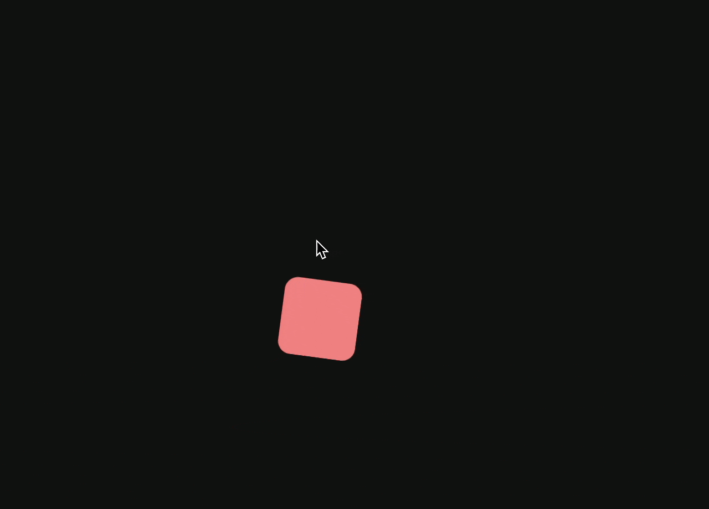

# postcss-spring-easing

[](https://bundlejs.com/?q=postcss-spring-easing&bundle "Check the total bundle size of postcss-spring-easing with whichever animation library you choose.")

<!--  -->

[NPM](https://www.npmjs.com/package/postcss-spring-easing) <span style="padding-inline: 1rem">|</span> [GitHub](https://github.com/okikio/postcss-spring-easing#readme) <span style="padding-inline: 1rem">|</span>  [Licence](./LICENSE)

Want your CSS animations to bounce and boogie 🕺 ? You've come to the right place! 

This PostCSS plugin gives your CSS the superpower to create "spring" animations, bringing your websites to life! Inspired by [postcss-easings](https://github.com/postcss/postcss-easings), it replaces `spring()` functions with a `linear()` easing function.


Here's a glimpse of how you can use it in your CSS:

```css
.snake {
  transition: all var(--spring-duration) spring-out;
}
.camel {
  transition: all var(--spring-duration) springOut;
}
```

And here's what it looks like once `postcss-spring-easing` works its magic:

```css
.snake {
  --spring-duration: 1333.33ms; 
  transition: all var(--spring-duration) linear(0, -0.003 24.3%, 0.025 43.2%, 0.024, 0.004 54.1%, -0.016 56.8%, -0.132 67.6%, -0.155, -0.163, -0.149, -0.107, -0.029, 0.086, 0.239 86.5%, 0.801 94.6%, 0.943, 1); 
} 
.camel {
  --spring-duration: 1333.33ms; 
  transition: all var(--spring-duration) linear(0, -0.003 24.3%, 0.025 43.2%, 0.024, 0.004 54.1%, -0.016 56.8%, -0.132 67.6%, -0.155, -0.163, -0.149, -0.107, -0.029, 0.086, 0.239 86.5%, 0.801 94.6%, 0.943, 1); 
}
```

> _**Note**: all the easings [spring-easing](https://github.com/okikio/spring-easing) supports `postcss-spring-easing` supports as well._

## Why use postcss-spring-easing? 🤔

CSS is great for designing your websites, including adding animations. But there are certain animation types, like a "spring" animation (imagine a bouncy ball), which CSS alone can't pull off.

> **Fun fact**: "spring" animations are how Apple is able to create smooth animations for the iPhone. 


<!-- > You can also read the [blog post](https://blog.okikio.dev/postcss-spring-easing), created for it's launch. -->




<!-- https://github.com/okikio/postcss-spring-easing/assets/17222836/3813945f-b301-4399-8383-bbab227c3f68

<video controls autoplay align="center" style="border-radius: 1rem; aspect-ratio: auto 1920 / 899;">
  <source src="media/assets/postcss-spring-easing-demo-video.mp4" type="video/mp4">
</video> -->

> _Check out more examples on [Codepen](https://codepen.io/okikio/pen/MWEMEgJ)._

`postcss-spring-easing` comes to your rescue! It's a plugin for PostCSS, which enhances the capabilities of your CSS. This plugin helps you craft spring animations effortlessly.

In a nutshell, `postcss-spring-easing` is a simple and effective tool for creating bouncy animations with minimum fuss, making your web pages more dynamic and fun.

Let's get coding! 🚀

## Installation

```bash
npm install postcss-spring-easing
```

<details>
  <summary>Others</summary>

```bash
yarn add postcss-spring-easing
```

or

```bash
pnpm install postcss-spring-easing
```

</details>

## Setting up PostCSS

To use this plugin, you need to have PostCSS set up in your project. If you haven't already, follow these steps:

First, install PostCSS:

```bash
npm install postcss
```

<details>
  <summary>Others</summary>

```bash
yarn add postcss
```

or

```bash
pnpm install postcss
```

Check your project for an existing PostCSS config: `postcss.config.js` in the project root,`"postcss"` section in the `package.json` or `postcss` in your bundle config.

Add the plugin to plugins list:
```diff
module.exports = {
  plugins: [
+   require('postcss-spring-easing').default,
    require('autoprefixer')
  ]
}
```

Or

```ts
// dependencies
var fs = require("fs")
var postcss = require("postcss")
var { springEasingPlugin } = require("postcss-spring-easing")

// css to be processed
var css = fs.readFileSync("input.css", "utf8")

// process css
var output = postcss()
  .use(springEasingPlugin())
  .process(css)
  .css
```
Checkout [tests](./tests/) for more examples.


## Usage

To create a spring animation, you just need to write your CSS transitions as usual, but replace the timing function with one of the following:

* `spring`
* `spring-in` 
* `spring-out` 
* `spring-in-out` 
* `spring-out-in` 

Each of these represents a different type of spring effect.

For example:

```css
.box {
  transition: transform 1s spring-out;
}
```

This will give a spring effect to the transform transition of the `.box` element.

The `spring-out` function here means that the animation will start slowly and end quickly, like a spring being released. Similarly, `spring-in` would start quickly and end slowly, and `spring-in-out` would start and end slowly with a quick middle, resembling the movement of a bouncing spring.

Now your animations are ready to bounce!

Have questions? Or just wanna talk--leave a message on [GitHub Discussions](https://github.com/okikio/postcss-spring-easing/discussions/1)

## Showcase

A couple sites/projects that use `postcss-spring-easing`:

- Your site/project here...

## Options

`postcss-spring-easing` has 4 options they are 
* `easing` (all the easings from [EasingFunctions](https://spring-easing.okikio.dev/types/typecsseasingoptions) are supported), 
* `easings` (list of extra custom easings to support),
* `decimal` (the number of decimal places of the resulting values), and
* `quality` (how detailed/smooth the spring easing should be)

| Properties  | Default Value           |
| ----------- | ----------------------- |
| `easing`    | `spring(1, 100, 10, 0)` |
| `easings`   | `{}`                    |
| `decimal`   | `3`                     |
| `quality`   | `0.85`                  |

### `easing`

By default, spring easings are supported in the form,

| constant | accelerate         | decelerate | accelerate-decelerate | decelerate-accelerate |
| :------- | :----------------- | :--------- | :-------------------- | :-------------------- |
|          | spring / spring-in | spring-out | spring-in-out         | spring-out-in         |

All **Spring** easing's can be configured using theses parameters,

`spring-*(mass, stiffness, damping, velocity)`

Each parameter comes with these defaults

| Parameter | Default Value |
| --------- | ------------- |
| mass      | `1`           |
| stiffness | `100`         |
| damping   | `10`          |
| velocity  | `0`           |

To understand what each of the parameters of `SpringEasing` mean and how they work I suggest looking through the [SpringEasing API Documentation](https://spring-easing.okikio.dev/functions/springeasing)

For a full understanding of what is happening in the `SpringEasing` library, pleace check out its [API site](https://spring-easing.okikio.dev/modules) for detailed API documentation.


```css
a {
  transition: all var(--spring-duration) spring(1, 100, 10, 0);
}
```

### `easings`

Allow to set custom easings:

```js
require('postcss-spring-easing').default({
  easings: { 
    bounceOut: t => {
      let pow2, b = 4;
      while (t < ((pow2 = Math.pow(2, --b)) - 1) / 11) { }
      return 1 / Math.pow(4, 3 - b) - 7.5625 * Math.pow((pow2 * 3 - 2) / 22 - t, 2);
    },
  }
})
```

The plugin will convert custom easing name between camelCase and snake-case.
So the example above would work for `bounce-out` and `bounceOut` easings.


## Browser Support

| Chrome | Edge | Firefox | Safari | IE  |
| ------ | ---- | ------- | ------ | --- |
| 113+   | 113+ | 112+    | -      | -   |

`postcss-spring-easing` is meant for browsers which have support for the `linear()` easing function, which as of right now is `Chrome & Edge 113` + `Firefox 112`, `Safari` doesn't support it yet.

## Contributing

I encourage you to use [pnpm](https://pnpm.io/configuring) to contribute to this repo, but you can also use [yarn](https://classic.yarnpkg.com/lang/en/) or [npm](https://npmjs.com) if you prefer.

Install all necessary packages

```bash
npm install
```

Then run tests

```bash
npm test
```

Build project

```bash
npm run build
```

> _**Note**: this project uses [Conventional Commits](https://www.conventionalcommits.org/en/v1.0.0/) standard for commits, so, please format your commits using the rules it sets out._

## Licence

See the [LICENSE](./LICENSE) file for license rights and limitations (MIT). 

The `CSSSpringEasing`, `getOptimizedPoints` and `getLinearSyntax` functions from `spring-easing` which are used in `postcss-spring-easing` are based of the work done by [Jake Archibald](https://github.com/jakearchibald/linear-easing-generator) in his [Linear Easing Generator](https://linear-easing-generator.netlify.app/) 
and are thus licensed under the [Apache License 2.0](https://github.com/jakearchibald/linear-easing-generator/blob/main/LICENSE).
